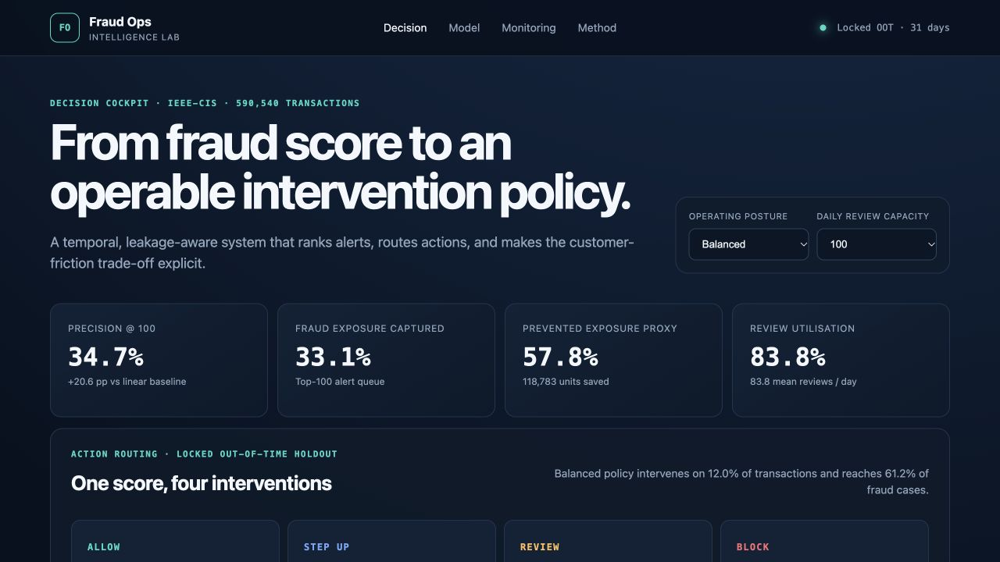

# Fraud Operations Intelligence Lab

[](https://github.com/thvh2006/fraud-ops-intelligence-lab/actions/workflows/ci.yml)
[](https://www.kaggle.com/competitions/ieee-fraud-detection/)
[](#validation-design)
[](LICENSE)

An end-to-end fraud decision system built around a constrained operations team—not a leaderboard-only classifier.

**[Open the interactive decision cockpit →](https://thvh2006.github.io/fraud-ops-intelligence-lab/)**

[](https://thvh2006.github.io/fraud-ops-intelligence-lab/)

Prefer an analyst handoff? **[Download the formula-driven Excel decision pack →](deliverables/Fraud_Ops_Analysis.xlsx)**

## The decision

> With limited daily investigation capacity and delayed labels, which transactions should be allowed, stepped up, reviewed, or blocked to capture the most fraud exposure while controlling legitimate-customer friction?

The offline evidence supports advancing a gradient-boosting challenger to **shadow mode**, not automatic blocking. On the locked chronological holdout, it more than doubles top-100 alert precision versus the calibrated linear baseline. The project then translates that score into a capacity-constrained four-action policy and exposes the assumptions behind every business claim.

## Executive readout

| Result | Locked OOT evidence | Why it matters |
|---|---:|---|
| Mean daily precision@100 | **34.84%** | +20.68 percentage points vs linear |
| Mean daily recall@100 | **35.80%** | Queue finds over one-third of daily fraud cases |
| Fraud exposure captured@100 | **32.44%** | Queue ranking reflects value, not only case count |
| Average precision | **0.461** | Up from 0.110 for the linear baseline |
| Balanced policy reach | **61.08%** of fraud cases | Across step-up, review, and block actions |
| Policy status | **Assumption-driven scenario** | Not observed prevention or realised savings |
| Maximum score PSI | **0.063** | Below the pre-declared 0.10 amber threshold |

The governed selection is `gbm_transaction`. Identity produced only a +0.30 percentage-point policy-window precision gain, below the pre-declared +1.00 point parsimony gate, and its locked-OOT interval crosses zero. The credible claim is that **non-linearity drives the improvement**; identity remains a research challenger, not a required dependency.

## What makes this more than a Kaggle model

- **Temporal integrity:** development, calibration, policy, and locked out-of-time partitions have separate jobs.
- **Leakage controls:** behavioural features use strictly prior events; same-time rows do not observe each other.
- **Operations-first evaluation:** daily entity-deduplicated precision@k, recall@k, exposure capture, queue use, and legitimate value interrupted.
- **Uncertainty, not point-score theatre:** day-level paired bootstrap tests whether feature-family gains are stable.
- **Decision policy:** allow, step-up, review, and block compete under explicit review capacity and cost assumptions.
- **Delayed labels:** fast selected investigator outcomes are separated from slower population outcomes.
- **Monitoring:** score drift, amount drift, calibration, alert quality, identity coverage, and new-entity rate.
- **Honest claims boundary:** exposure is not loss; simulated cost reduction is not realised savings; offline promotion is not production approval.
- **Entity caveat:** the queue key is an engineered proxy, not a verified customer identifier; production deduplication requires an independently validated entity-resolution layer.

## Data

The analysis uses the **IEEE-CIS Fraud Detection** dataset: real, anonymised e-commerce transactions supplied by Vesta Corporation for the competition. The labelled source contains:

- 590,540 transactions across 182 elapsed days;
- 20,663 fraud-labelled transactions, a 3.50% base rate;
- 394 transaction columns plus 40 identity features;
- 24.42% identity-table coverage;
- weekly fraud rates from 1.85% to 5.06%;
- 24.71% of fraud cases concentrated in the top 1% of proxy entities.

Raw competition files are never committed. To reproduce the work, accept the Kaggle rules and place the five downloaded files under `data/raw/`; see [the data contract](data/README.md).

## Validation design

The labelled table is stably sorted by elapsed event time and transaction ID, then split once:

```text
Development 60%       Calibration 15%      Policy 10%       Locked OOT 15%
fit features/models → calibrate probability → choose policy → evaluate once
354,324 rows          88,581 rows          59,054 rows      88,581 rows
```

No random split is used for the final claim. No model, feature choice, threshold, or cost scenario is selected on the locked OOT labels.

## Model ladder

| Candidate | Purpose | OOT AP | OOT ROC-AUC | OOT Brier |
|---|---|---:|---:|---:|
| Rules | Transparent operating benchmark | 0.065 | 0.687 | 0.0332 |
| Calibrated linear | Leakage-safe interpretable baseline | 0.110 | 0.711 | 0.0332 |
| GBM transaction core | Test non-linearity without identity | 0.461 | 0.880 | **0.0241** |
| GBM + identity | Research challenger; below parsimony gate | 0.460 | **0.883** | 0.0242 |
| GBM + behaviour | Test past-only velocity/novelty features | 0.455 | 0.878 | 0.0244 |

The transaction GBM improves daily precision by 20.68 percentage points over the linear baseline. Its difference from the identity challenger is not established: OOT mean difference is +0.13 percentage points with a 95% interval from −0.68 to +0.94.

## Four-action policy

The balanced reference scenario at 100 nominal reviews/day routes the locked holdout as follows:

| Action | Transactions | Observed fraud rate | Role |
|---|---:|---:|---|
| Allow | 78,065 | 1.54% | No intervention |
| Step-up | 6,372 | 8.46% | Additional authentication |
| Review | 2,601 | 12.53% | Capacity-constrained analyst queue |
| Block | 1,543 | 65.98% | High-confidence simulated intervention |

The dashboard lets the reader switch among customer-first, balanced, and loss-first assumptions at capacities of 50, 100, 250, and 500. This makes the customer-friction trade-off inspectable instead of hiding it behind one “optimal” threshold.

## Delayed labels and monitoring

The simulated fast investigator stream is highly selected: its fraud rate is 33.85% versus 2.33% outside review, a 14.5× ratio. Weekly recalibration is therefore backtested only with labels available at each snapshot under 7-, 14-, and 30-day delays.

Rolling recalibration improves mean Brier score by only 0.00007–0.00008. The recommendation is to keep collecting delayed population outcomes and monitor calibration, not to introduce automatic frequent retraining without a material gain.

## Repository map

```text
dashboard/                interactive static decision cockpit
configs/                  data, operations and economics assumptions
data/                     ignored raw/interim/processed zones + contract
deliverables/             formula-driven Excel analyst pack
docs/                     research record, model card and decision memos
reports/                  reproducible aggregate evidence
scripts/                  pipeline entry points and dashboard-data build
src/                      reusable temporal, feature, metric and policy logic
tests/                    executable safeguards
```

Key review documents:

- [Excel decision pack](deliverables/Fraud_Ops_Analysis.xlsx) — executive summary, policy simulator, model review, weekly monitoring, data profile, and traceable source tables
- [Executive decision memo](docs/executive_decision_memo.md)
- [Model card](docs/model_card.md)
- [Model comparison and uncertainty](docs/model_comparison_uncertainty.md)
- [Policy decision memo](docs/policy_decision_memo.md)
- [Delayed labels and monitoring](docs/monitoring_and_delayed_labels.md)
- [Source and evidence review](docs/source_and_evidence_review.md)

## Reproduce the analysis

Requires Python 3.10+ and locally downloaded competition files.

```bash
python -m venv .venv
source .venv/bin/activate
pip install -e ".[dev]"

python scripts/validate_raw_data.py
python scripts/profile_data.py
python scripts/train_baseline.py
python scripts/train_challenger.py
python scripts/compare_models.py
python scripts/design_policy.py
python scripts/backtest_monitoring.py
python scripts/build_dashboard_data.py
pytest
```

To inspect the dashboard locally:

```bash
python -m http.server 8000 --directory dashboard
```

Then open `http://localhost:8000`.

## Claims boundary

This is a portfolio-grade operational simulation on real anonymised transactions. It is not a deployed fraud system. `TransactionAmt` is exposure, not confirmed recoverable loss. Investigation decisions, chargeback dates, actual intervention effectiveness, true operating costs, protected attributes, and customer outcomes are not available. A real rollout requires shadow-mode evidence, controlled intervention measurement, privacy/security review, fairness assessment, and customer-redress governance.

Code is available under the [MIT License](LICENSE). The IEEE-CIS data remains subject to Kaggle’s competition rules and is not covered by this repository’s license.
